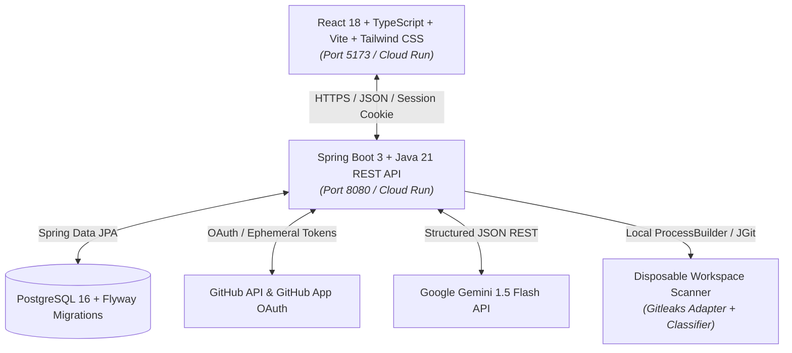

> **Document:** Scan Pilot Software Requirements Specification (SRS)
> **File:** `docs/requirements/SRS.md`
> **Version:** v2.0.0
> **Created:** 2026-08-11
> **Last Updated:** 2026-08-19
> **Status:** Active

# Scan Pilot Software Requirements Specification (SRS)

## 1. Introduction

### 1.1 Purpose
This document provides the formal Software Requirements Specification (SRS) for **Scan Pilot**, a continuous multi-project health and security monitoring platform designed specifically for AI-generated and AI-assisted software projects.

### 1.2 Product Scope
Scan Pilot solves the security gap in modern software engineering where developers rapidly generate code with AI assistants (Gemini, ChatGPT, GitHub Copilot) but lack automated, human-friendly tools to detect leaked API keys, tokens, and configuration flaws. Scan Pilot connects directly to GitHub, executes multi-stage security scans (Snapshot HEAD + Git History), manages finding lifecycles (`OPEN` -> `RESOLVED` -> `REGRESSED`), and leverages **Google Gemini AI** to provide plain-language explanations and before/after remediation diffs.

### 1.3 Core Specifications Hierarchy
1. **Functional Requirements (FR-001 to FR-051):** [`docs/REQUIREMENTS.md`](../REQUIREMENTS.md)
2. **Use Cases (UC-001 to UC-006):** [`docs/USE-CASES.md`](../USE-CASES.md)
3. **Non-Functional Requirements (NFR-001 to NFR-010):** [`docs/NON-FUNCTIONAL-REQUIREMENTS.md`](../NON-FUNCTIONAL-REQUIREMENTS.md)
4. **Inspection Rule Contracts (SP-CONFIG-001):** [`docs/INSPECTION-SPEC.md`](../INSPECTION-SPEC.md)
5. **Evidence & Provenance Model:** [`docs/EVIDENCE-MODEL.md`](../EVIDENCE-MODEL.md)
6. **Finding Tracking & Lifecycle Model:** [`docs/FINDING-TRACKING.md`](../FINDING-TRACKING.md)
7. **Cloud Budget & Guardrails:** [`docs/CLOUD-BUDGET.md`](../CLOUD-BUDGET.md)
8. **Accepted Architectural Decisions:** [`docs/DECISIONS.md`](../DECISIONS.md)

---

## 2. System Architecture & Technology Stack

* **Frontend:** React 18, TypeScript, Vite, Tailwind CSS (following `design-taste-frontend` and WCAG AA standards).
* **Backend:** Spring Boot 3.3, Java 21 LTS, Maven, Spring Data JPA, Hibernate, Flyway.
* **Database:** PostgreSQL 16 (12 core tables initialized via `V1__init_core_schema.sql`).
* **AI Provider:** Google Gemini (`gemini-1.5-flash` default via Spring 6 `RestClient`).
* **Security Scanner:** Gitleaks Detector Adapter with trusted `SP-CONFIG-001` policy + Embedded Regex Fallback.

---

## 3. Functional Requirements (FR Summary)

| Domain | IDs | Key Capabilities |
|---|---|---|
| **Auth & GitHub Integration** | `FR-001`, `FR-046`, `FR-047` | GitHub OAuth sign-in, session cookies (`HttpOnly`), GitHub App linking, personal account repository scoping (`DEC-046`). |
| **Branch Management** | `FR-020`, `FR-022`, `FR-023` | 1 `PRIMARY` branch auto-derived from GitHub default; max 2 user-selected `SECONDARY` branches; non-destructive branch sync. |
| **Content Classification & Bounds** | `FR-031`, `FR-034`, `FR-035`, `FR-037` | 8 KiB byte-sampling buffer; magic byte recognition; binary documents (`PDF`/`DOCX`) marked `UNSUPPORTED_BINARY_DOCUMENT`; 10 MiB Continuous limit / 50 MiB Release ceiling. |
| **Secret Detection Engine** | `FR-009`, `FR-026`, `FR-038` | Gitleaks adapter with pinned trusted `SP-CONFIG-001` policy; anti-tamper safeguards; embedded fallback scanner; secure JSON deletion in `try-finally`. |
| **Secret Fingerprinting & Redaction** | `FR-017`, `FR-048` | `SP_SECRET_FP_V1` length-prefixed HMAC-SHA-256 fingerprinting (**REC-03**); token masking; code snippet sanitization with `[REDACTED_SECRET]`. |
| **Scan Pipeline & Lifecycle Engine** | `FR-002`, `FR-007`, `FR-018`, `FR-019`, `FR-025`, `FR-051` | Stage 1 (HEAD snapshot) + Stage 2 (Git history); 3-stage lifecycle (`OPEN/ACTION_REQUIRED` -> `RESOLVED/RISK_CONTAINED` -> `RESOLVED/VERIFIED_COMPLETE` -> `REGRESSED/ACTION_REQUIRED`). |
| **Gemini AI Explanation Service** | `FR-005`, `FR-048` | Bounded secret-redacted prompt; structured JSON response (Summary, Risk Impact, Evidence Limits, Remediation Steps, Before/After Diff, Revocation Command); deterministic fallback templates; fingerprint caching. |
| **Dashboard & Coverage Reporting** | `FR-004`, `FR-008`, `FR-028`, `FR-044` | Action-oriented health dashboard; live scan execution progress; transparent coverage records and skipped files audit. |

---

## 4. Use Case Specifications (UC-001 to UC-006)

Full step-by-step actor interactions and exception flows are specified in [`docs/USE-CASES.md`](../USE-CASES.md):
- **UC-001:** GitHub Authentication & App Installation Linking
- **UC-002:** Monitored Repository Selection & Branch Slot Configuration
- **UC-003:** On-Demand & Continuous Security Scan Execution
- **UC-004:** Finding Inspection & AI-Assisted Remediation
- **UC-005:** Re-scan Lifecycle Tracking & Resolution Verification
- **UC-006:** Transparent Scan Coverage & Skipped Content Audit

---

## 5. Non-Functional Requirements (NFR-001 to NFR-010)

Full quantitative metric targets and verification methods are specified in [`docs/NON-FUNCTIONAL-REQUIREMENTS.md`](../NON-FUNCTIONAL-REQUIREMENTS.md):
- **NFR-001 (API Latency):** p95 < 200ms for read queries, p95 < 500ms for job triggers.
- **NFR-002 (Scan Throughput):** Snapshot scan < 5s, Reachable History baseline < 15s.
- **NFR-003 (Gemini AI Latency & Fallback):** Response < 3s, timeout 15s, 100% fallback reliability.
- **NFR-004 (Zero Secret Exposure):** 0 unmasked secrets in DB, logs, prompts, or UI (100% redaction).
- **NFR-005 (Memory Safety):** Bounded 8 KiB sampling, 10/50 MiB size ceilings, 100% workspace deletion.
- **NFR-006 (Accessibility):** WCAG 2.1 AA compliant (contrast > 4.5:1), `tabular-nums` numeric stability.
- **NFR-007 (State Completeness):** 4 complete UI states (Skeleton, Empty, Error, Normal).
- **NFR-008 (Browser Compatibility):** Chrome 120+, Firefox 120+, Safari 17+, Edge 120+; iOS `dvh` stable.
- **NFR-009 (Cloud Budget):** Expected <= $180 USD, $70 reserve within $250 envelope, scale-to-zero.
- **NFR-010 (Data Integrity):** ACID transactions, composite unique constraints (`UNIQUE(repository_id, fingerprint)`).
